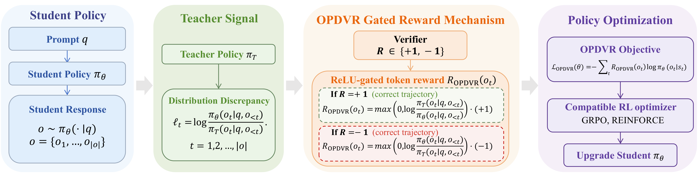

<div align="center">

# OPDVR: On-policy Distillation with Verifiable Reward

**[📄 Paper](https://arxiv.org/abs/2608.24696)**


</div>

<p align="center">
  
</p>

## 📖 Overview

Reinforcement Learning with Verifiable Rewards (RLVR) provides sparse task-level feedback, while
on-policy distillation (OPD) provides dense token-level guidance but ignores trajectory correctness.
**OPDVR** combines the two with an *extremely simple* mechanism and **zero extra hyperparameters**.
Vanilla OPD rewards each token by the teacher–student log-ratio,

$$
R_{\text{OPD}}(o_t) = \log \frac{\pi_T(o_t \mid q, o_{\lt t})}{\pi_\theta(o_t \mid q, o_{\lt t})},
$$

equivalently, decomposed by trajectory correctness,

$$
R_{\text{OPD}}(o_t)=
\begin{cases}
\log \dfrac{\pi_T(o_t \mid q, o_{\lt t})}{\pi_\theta(o_t \mid q, o_{\lt t})} \cdot (+1), & \text{trajectory correct},\\
\log \dfrac{\pi_\theta(o_t \mid q, o_{\lt t})}{\pi_T(o_t \mid q, o_{\lt t})} \cdot (-1), & \text{trajectory incorrect},
\end{cases}
$$

a dense signal that is completely blind to trajectory correctness — the log-ratio is applied
verbatim regardless of whether the trajectory is valid. **OPDVR** instead passes it through a
ReLU gate keyed by the verifier:

$$
R_{\text{OPDVR}}(o_t) =
\begin{cases}
\max(0, \log \dfrac{\pi_T(o_t \mid q, o_{\lt t})}{\pi_\theta(o_t \mid q, o_{\lt t})}) \cdot (+1), & \text{trajectory correct},\\
\max(0, \log \dfrac{\pi_\theta(o_t \mid q, o_{\lt t})}{\pi_T(o_t \mid q, o_{\lt t})}) \cdot (-1), & \text{trajectory incorrect}.
\end{cases}
$$

   * correct trajectories → non-negative rewards 
   * incorrect trajectories → non-positive rewards 

The verifier (task reward) determines the **direction** of every token update; the teacher controls
its **magnitude**. Tokens whose learning direction conflicts with the verifier are simply masked out.

 **GRPD (Group Relative Policy Distillation)**: because OPDVR is now a proper RLVR reward,
   the binary signal can be replaced by any policy-gradient advantage — we instantiate it
   with GRPO-style group-relative advantages.

Experiments on six reasoning benchmarks (AIME24/25, AMC, MATH500, Minerva, OlympiadBench) show
OPDVR consistently outperforms standard OPD.

## 📊 Main Results (avg@16)

**Same-architecture distillation** (Qwen3-4B ← Qwen3-4B-RL):

| Method | AIME24 | AIME25 | AMC | MATH500 | Minerva | OlympiadBench |
|---|---|---|---|---|---|---|
| Student (Qwen3-4B) | 24.0 | 15.8 | 60.8 | 80.9 | 27.6 | 42.9 |
| Teacher (Qwen3-4B-RL) | 36.0 | 29.0 | 65.9 | 87.0 | 35.4 | 49.3 |
| Sampled-Token OPD | 34.2 | 26.0 | 63.1 | **85.5** | 31.6 | 46.5 |
| Top-64 OPD | 34.6 | 23.5 | 62.0 | 85.0 | 32.2 | 46.8 |
| **OPDVR (Ours)** | **36.9** | **28.1** | **64.8** | 84.7 | **33.2** | **47.0** |

**Cross-architecture distillation** (Qwen3-1.7B-Base ← Qwen3-4B-Base-RL):

| Method | AIME24 | AIME25 | AMC | MATH500 | Minerva | OlympiadBench |
|---|---|---|---|---|---|---|
| Student (Qwen3-1.7B-Base) | 4.1 | 1.7 | 23.2 | 48.9 | 8.9 | 17.1 |
| Teacher (Qwen3-4B-Base-RL) | 10.6 | 13.1 | 40.3 | 74.2 | 17.2 | 30.0 |
| Sampled-Token OPD | 6.5 | 2.1 | 24.8 | 59.1 | 11.5 | 21.6 |
| Top-64 OPD | 8.5 | 3.3 | 26.4 | 60.1 | 10.7 | 21.4 |
| **OPDVR (Ours)** | **8.5** | **3.3** | **30.3** | **60.8** | **11.6** | **22.0** |

## ✨ Repo Structure

```
OPDVR/
├── opdvr.sh                    # OPDVR training (the paper's main method)
├── grpd.sh                     # GRPD variant (group-relative advantage, G=8)
├── opd_baseline.sh             # vanilla sampled-token OPD baseline
├── ablation_inverse_gated.sh   # inverse-gate ablation (Table: ablation study)
├── verl/                       # fork of verl v0.7.0 containing the OPDVR implementation
└── datasets/                   # training + eval data (parquet)
```

## 🔧 Where the Method Lives

| Piece | File | What it does |
|---|---|---|
| OPDVR reward gate | `verl/verl/trainer/ppo/ray_trainer.py` (search `correctness_gated`) | ReLU-clamps the OPD reward by per-response correctness |
| GRPD scaling | `verl/verl/trainer/ppo/ray_trainer.py` (search `grpo_scaled`) | multiplies gated reward by group advantage|
| config knobs | `verl/verl/workers/config/rollout.py` | all OPDVR/GRPD switches |

Key config switches (all env-overridable in the run scripts):

| Switch | Meaning |
|---|---|
| `LOG_PROB_TOP_K` | `0` = sampled-token OPD (paper main); `>0` = top-k OPD |
| `CORRECTNESS_GATED` | `True` = OPDVR; `False` = vanilla OPD |
| `CORRECTNESS_GATED_MODE` | `default` (paper) / `inverse` (ablation) |
| `CORRECTNESS_THRESHOLD` | verifier threshold, default 0 (score > 0 = correct) |
| `GRPO_SCALED` | `True` = GRPD |
| `GRPO_NORM_BY_STD` | `False` = Dr.GRPO-style advantage (paper); `True` = /std |
| `N_RESPONSES` | group size G for GRPD (paper uses 8) |

## 🚀 Getting Started

### Environment

```bash
conda create -n verl python==3.12
conda activate verl
cd verl/
USE_MEGATRON=0 bash scripts/install_vllm_sglang_mcore.sh
pip install --no-deps -e .
```

### Train

Everything is launched from the scripts in the repo root:

```bash
bash opdvr.sh                    # OPDVR
bash grpd.sh                     # GRPD (group-relative advantage variant)
bash opd_baseline.sh             # OPD baseline
bash ablation_inverse_gated.sh   # inverse-gate ablation
```

All knobs (models, data, method switches) are environment variables set at the top of each
script — edit them or override on the command line, e.g. `ACTOR_MODEL_PATH=... REWARD_MODEL_PATH=... bash opdvr.sh`.
Training data and the val set are under `datasets/`.

### Evaluate

Evaluation runs **inside the training loop** (verl's built-in validation):
`val_kwargs.n=16` gives the paper's avg@16 protocol on `datasets/valid_final_unique.parquet`,
reported as `val-core/...` in wandb / console every `TEST_FREQ` (default 22) steps.
No separate eval repo is needed — checkpoints saved under `checkpoints/<experiment>` can also
be evaluated offline with any vLLM harness against the same parquet.

`valid_final_unique.parquet` (1,590 problems) combines the paper's six benchmarks:
**AIME24** (30), **AIME25** (30), **AMC** (83), **MATH-500** (500), **Minerva** (272),
**OlympiadBench** (675).


## 📚 Citation

If you find this work useful, please cite:

```bibtex
@article{lin2026policy,
  title={On-policy Distillation with Verifiable Reward},
  author={Lin, Wenze and Zhao, Jiale and Jiang, Xitai and Rao, Songde and Li, Yining and Wang, Shenzhi and He, Bingxiang and Huang, Gao},
  journal={arXiv preprint arXiv:2608.24696},
  year={2026}
}
```

## Acknowledgements

- [OPD](https://github.com/thunlp/OPD) (*Rethinking On-policy Distillation of Large Language
  Models*) — this repo is developed on top of it; the OPD training framework comes from there.
- [verl](https://github.com/volcengine/verl) (v0.7.0) — the underlying RL training framework.
